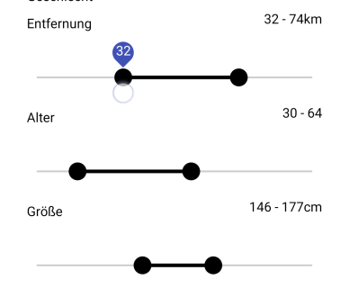

# ti.rangebar

<span class="badge-buymeacoffee"><a href="https://www.buymeacoffee.com/miga" title="donate"></a></span>



Appcelerator Titanum Rangebar module for Android.<br/>
Based on https://github.com/oli107/material-range-bar

```xml
<RangebarView module="ti.rangebar" onChange="onChangeDistance" tickStart="2" tickEnd="100" tickInterval="2" connectionLineColor="#000" tickColor="transparent" leftThumbColor="#000" rightThumbColor="#000" height="Ti.UI.SIZE"/>
```
